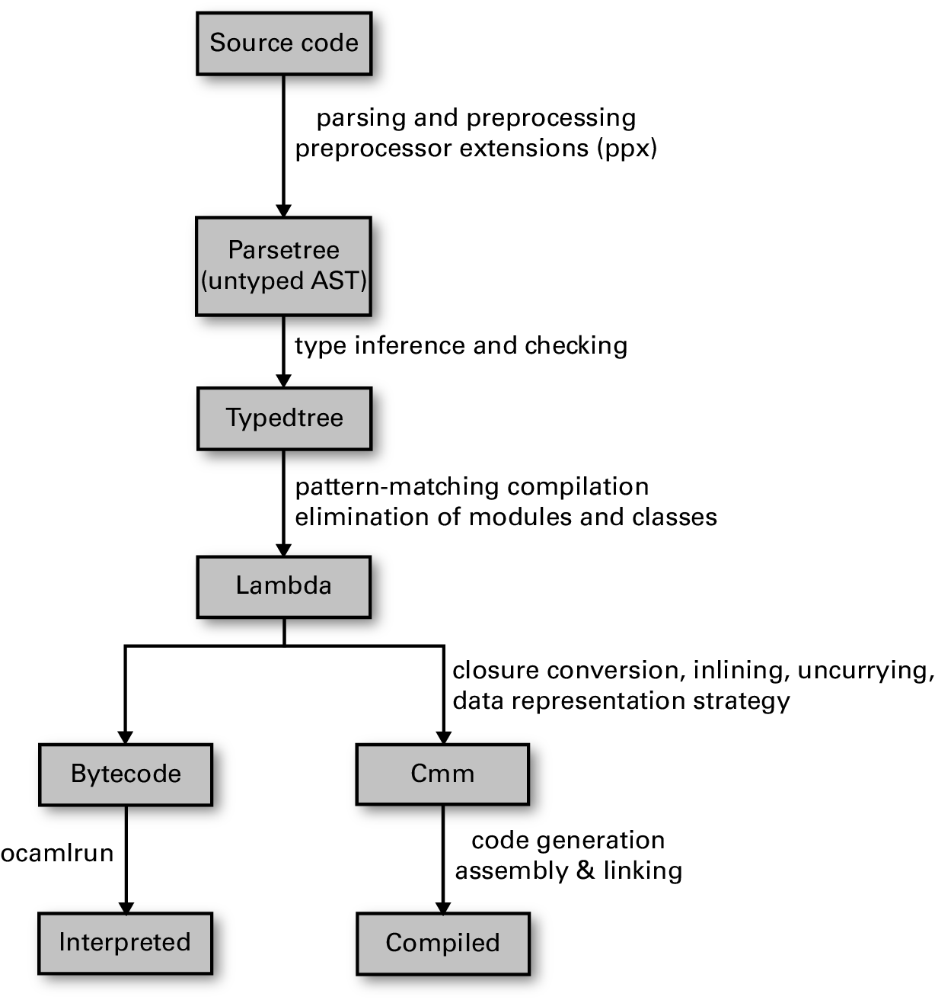

# OCaml & Catala installation

[Real World OCaml 2nd Ed.](https://dev.realworldocaml.org/files-modules-and-programs.html)[^1].

[^1]: Real World OCaml - FUNCTIONAL PROGRAMMING FOR THE MASSES - 2nd Edition (Oct 2022)

## Intro[^2]

[^2]: Real World OCaml - FUNCTIONAL PROGRAMMING FOR THE MASSES - 2nd Edition (Oct 2022) - Prologue

### Standard library and OCaml Platform (opam, base, core, async, dune, lnaguage server protocol and utop)

- The role of the standard library is bootstrapping the compiler. Apart from that it covers only a subset of the functionality you would expect from a general-purpose standard library. 
- **opam** is a package management tool that makes the installation and management of  third-party libraries such as base, core, async etc. much easier and is the basis of the OCaml Platform. 
- The **Base** library supplements the standard library and is distributed with a set of syntax extensions that provide useful new functionality to OCaml. Base is designed to be lightweight, portable, and stable, while providing all of the fundamentals you need from a standard library. There are additional libraries that are designed to work well with it, including **Core**, an extension to Base that includes a wealth of new data structures and tools; and **Async**, a library for concurrent programming of the kind that often comes up when building user interfaces or networked applications.
- Constituent tools of the OCaml Platform further include the **dune** build system and a **language server** to integrate with popular editors such as Visual Studio Code. 
- The **utop** command-line interface is a modern interactive tool that supports command history, macro expansion, module completion, and other niceties that make it much more pleasant to work with the language. utop is an easier-to-use version of OCaml'92s standard toplevel (which you can start by typing ocaml at the command line).

### [Installation](http://dev.realworldocaml.org/install.html) (opan init, opam switch, eval$(opam env), opam instal ...)

Initialize the opam package database by running:
```
$ opam init
```
'opam init' will ask you if you want it to adjust some of the config files for your shell. We recommend you say yes here so as to automate adjusting the PATH environment variable of your shell and to prepare your environment in other ways. Note that this will only take effect on a newly launched shell.

You can check if your environment is set up properly by running
```
$ opam switch
```
It will emit a warning if your shell is not set up correctly. We can use opan to install other versions:
```
$ opam switch create 4.13.1
$ eval $(opam env)
```
The opam switch create will take a few minutes on a modern machine, and will download and install the new compiler and all libraries associated with it. The second line is required to point your current shell to the new switch.

You'll need to install base and core, which provide the standard library that all the examples in the book are based on, along with utop, which is the interactive toplevel that you can use for working through the examples.
```
$ opam install core core_bench utop
```
Then, create an `~/.ocamlinit` file in your home directory with the following contents:
```
#require "core.top";;
#require "ppx_jane";;
open Base;;
```
Set up your Visual Studio Code with the OCaml Platform plug-in. You'll also need an OCaml Language-Server-Protocol server, which you can install via opam following these instructions [https://github.com/ocaml/ocaml-lsp#installation].

## Part I - Language Concepts (core language, modules, functors and objects)

### Chapter 4 - Files, Modules and Programs

For real-world programs, you’ll need to leave the toplevel behind and start building programs from files. Files are more than just a convenient way to store and manage your code; in OCaml, they also correspond to modules, which act as boundaries that divide your program into conceptual units. Mostly, the declaration starting with `let () =` plays the role of the **main** function, kicking off the processing.

#### Single-file programs

Unlike programs in C, Java or C#, programs in OCaml don’t have a unique main function. When an OCaml program is evaluated, all the statements in the implementation files are evaluated in the order in which they were linked together.

For a filename.ml program, if we weren’t using Base or any other external libraries, we could build the executable like this:
```
$ ocamlopt filename.ml -o filename
```
However, because we are using Base and Stdio, we need a somewhat more complex invocation to get them linked in:
```
$ ocamlfind ocamlopt -linkpkg -package base -package stdio filename.ml -o filename
```
This uses **ocamlfind**, a tool which itself invokes other parts of the OCaml toolchain (in this case, **ocamlopt**) with the appropriate flags to link in particular libraries and packages. Here, -package base is asking ocamlfind to link in the Base library; -linkpkg asks ocamlfind to link in the packages as is necessary for building an executable. (the above command creates `filename`, `filename.cmi`. `filename.cmx` and `filename.o`.)

#### Dune Files

While this works well enough for a one-file project, more complicated projects require a tool to orchestrate the build. One good tool for this task is `dune`. To invoke dune, you need to have two files: a `dune-project` file for the overall project, and a `dune` file that configures the particular directory. This is a single-directory project, so we’ll just have one of each, but more realistic projects will have one dune-project and many dune files.

At its simplest, the `dune-project` just specifies the version of the dune configuration-language in use:
```
(lang dune 3.0)
```
We also need a `dune` file to declare the executable we want to build, along with the libraries it depends on:
```
(executable
  (name      filename)
  (libraries base stdio))
```
With that in place, we can invoke dune as follows:
```
$ dune build filename.exe
```
Executables built with dune will be left in the `_build/default` directory, from which they can be invoked. 

We can run the resulting executable, filename.exe, from the command line. (Note: grep is short for "global regular expression print" - a useful command to search for matching patterns in a file.[^4]):

[^4]: More info on grep: [https://www.freecodecamp.org/news/grep-command-in-linux-usage-options-and-syntax-examples/]

```
$ grep -Eo '[[:alpha:]]+' filename.ml | ./_build/default/filename.exe
```
The specific invocation above will count the words that come up in the file freq.ml itself. Conveniently, dune allows us to combine the building and running an executable into a single operation, which we can do using dune exec:
```
$ grep -Eo '[[:alpha:]]+' filename.ml | dune exec ./filename.exe
```

#### Multiple files and modules

Source files in OCaml are tied into the module system, with each file compiling down into a module whose name is derived from the name of the file.

For example  we can factor out the key functionality of freq.ml into a separate module with an explicit interface. We’ll start by creating a file, counter.ml, that contains the logic for maintaining the association list used to represent the frequency counts. The file counter.ml will be compiled into a module named Counter, where the name of the module is derived automatically from the filename. The module name is capitalized even if the file is not.

We can now rewrite freq.ml to use Counter. The resulting code can still be built with dune, which will discover dependencies and realize that counter.ml needs to be compiled:
```
$ dune build freq.exe
```
## Part II - useful tools and techniques for addressing common practical applications, from command-line parsing to asynchronous network programming

### Chapter 21 - The OCaml Platform

The OCaml community has developed a suite of modern tools to interface it with IDEs such as Visual Studio Code, and to generate API documentation and implement modern software engineering practices such as continuous integration (CI) and unit or fuzz testing. All you need to do is to specify your project metadata (for example, library dependencies and compiler versions), and the OCaml Platform tools that we’ll describe next will do much of the heavy lifting.

#### How to use opam within a full project

https://opam.ocaml.org/doc/Usage.html

First, initialize opam’s global state. An existing opam root is required for opam to operate normally, and one is created upon running opam init.
```
$ opam init
```
By default, opam doesn’t require any special user permissions and stores all of the files it installs in ~/.opam. opam holds its configuration, metadata, logs, temporary directories and caches within a directory. By default, this is ~/.opam.

You can maintain multiple development environments with different packages and compilers installed, each of which is called a “switch” – the default one can be found under ~/.opam/default.  Run opam switch to see all the different sandboxed environments you have available:
```
$ opam switch
```
opam is designed to hold any number of concurrent installation prefixes, called switches. Switches are isolated from each other and have their own set of installed packages. Command opam env returns the environment updates corresponding to the current switch:
```
$ eval $(opam env)
```
#### a sample OCaml project

Dune has a basic built-in command to initialize a project template. Dune will create a hello/ directory and populate it with a skeleton OCaml project. (Make sure the directory does not contain any space characters.)
```
$ dune init proj hello
```
The next thing we need is a suitable environment for this project, with dune and any other library dependencies available. The best way to do this is to create a new opam sandbox, via the opam switch create command. If you specify a project directory argument to this command, then it creates a “local switch” that stores all the dependencies within that directory rather than under ~/.opam. This is a convenient way to keep all your build dependencies and source code in one place on your filesystem. Let’s make a local switch for our hello world project now:  
```
$ cd hello
$ opam switch create .
$ opam install dune
```
This invokes opam to install the project dependencies (in this case, just the OCaml compiler and dune as we didn’t specify any more when initializing the project - The default operation of opam switch create is to calculate the latest supported compiler version from your project metadata and use that one for the local switch.). All of the files from the local switch will be present under _opam/ in the working directory. Since opam will install other binaries and libraries in the local switch as your project grows, you will need to add the switch to your command-line path. (opam install dune will install the dune package.)

You can use opam env to add the right directories to your local shell path so that you can invoke the locally installed tools:
```
$ eval $(opam env)
```
If you prefer not to modify your shell configuration, then you can also invoke commands via opam exec to modify the path for the subcommand specified in the remainder of the command line:
```
$ opam exec -- dune build
```
This executes dune build with the opam environment variables added to the command invocation, so it will pick up the locally built dune from your project. The double dash in the command line is a common Unix convention that tells opam to stop parsing its own optional arguments for the remainder of the command, so that they don’t interfere with the command that is being executed.

When creating a switch, opam analyses the project dependencies and selects the newest OCaml compiler that is compatible with them. Sometimes though, you will want to select a specific version of the OCaml compiler, perhaps to ensure reproducibility or to use a particular feature. To get a full list of all the compilers that are available you can use:

$ opam switch list-available

ocaml-system is the name opam uses for the pre-existing version of the OCaml compiler that was already installed on your machine. This compiler is always fast to install since nothing needs to be compiled for it. The only thing needed to create a system switch is to have the right version of OCaml already installed (e.g. via apt or Homebrew) and to pass the same version to the switch creation as an additional argument.

For example, if you have OCaml 4.13.1 installed, then running this command will use the system compiler:

$ opam switch create . 4.13.1

On the other hand, if you didn’t have that system compiler installed, then the compiler will need to be built from scratch. The command above would select the ocaml-base-compiler package in this case, which contains the full OCaml compiler source code. It will take a little longer than ocaml-system, but you have much more flexibility about the choice of versions.

#### Structure of an OCaml Project

```
.
|-- dune-project
|-- hello.opam
|-- lib
|   |-- dune
|-- bin
|   |-- dune
|   `-- main.ml
`-- test
    |-- dune
    `-- hello.ml
```

Apart from _opam and _build directory we have the above folder structure in  our hello project:
- The dune-project file marks the root of the project, and is used for writing down some key metadata for the project (more on that later).
- The hello.opam file contains metadata for registering this software as an opam project. As we’ll see, we won’t need to edit this manually because we can generate the file via dune.
- There are three source directories, each with its own dune file specifying the build parameters for that part of the codebase.
  - The lib directory would contain the bulk of the source.
  - The bin directory would contain a thin wrapper on top of the code in lib which actually launches the executable.
  - The test directory has the bulk of the tests for lib.

Let’s create a Msg module in our skeleton project inside lib/:

$ echo 'let greeting = "Hello World"' > lib/msg.ml
$ echo 'val greeting : string' > lib/msg.mli

An OCaml module is defined by a matching pair of ml and mli files. Module names are name after the file(s) and capitalized. It's the only kind of name you refer to within OCaml code. A valid OCaml module name cannot contain dashes or other special characters other than underscores.

#### Libraries (Collections of Modules)
One or more OCaml modules can be gathered together into a library, providing a convenient way to package up multiple dependencies with a single name. A project usually puts the business logic of the application into a library rather than directly into an executable binary, since this makes writing tests and documentation easier in addition to improving reusability.

Libraries are defined by putting a dune file into a directory, such as the one generated for us in lib/dune:

(library
 (name hello))

Dune will treat all OCaml modules in that directory as being part of the hello library (this behavior can be overridden by a modules field for more advanced projects). By default, dune also exposes libraries as wrapped under a single OCaml module, and the name field determines the name of that module. In our example project, msg.ml is defined in lib/dune which defines a hello library. Thus, users of our newly defined module can access it as Hello.Msg. Other modules within the hello library can simply refer to Msg.

You must refer to library names in a dune file when deciding what libraries to link in, and never individual module names. You can query the installed libraries in your current switch via ocamlfind list at your command prompt, after running opam install ocamlfind to install it if necessary: 

$ opam install ocamlfind
$ ocamlfind list

Now compare the dune file in the lib and the bin directory: The (libraries) field in the lib/dune file does not exist. The public library name is what you specify via the libraries field in other projects that use your project’s libraries. Without a public name, the defined library is local to the current dune project only. If there was a public_name field present in the dune library definition, this determines the publicly exposed name for the library.  

#### Build an executable program
Finally, we want to actually use our hello world from the command-line. This is defined in bin/dune:

(executable
 (public_name hello)
 (name main)
 (libraries hello)))

There has to be a bin/main.ml alongside the bin/dune file that represents the entry module for the executable. Only that module and the modules and libraries it depends on will be linked into the executable. Much like libraries, the (name) field here has to adhere to OCaml module naming conventions, and the public_name field represents the binary name that is installed onto the system and just needs to be a valid Unix filename.

Now try modifying bin/main.ml to refer to our Hello.Msg module:

$ let () = print_endline Hello.Msg.greeting

You can build and execute the command locally using dune exec and the local name of the executable. You can also find the built executable in _build/default/bin/main.exe:

$ dune build
$ dune exec -- bin/main.exe

The executable can be found under _build/default/bin/main.exe. You can also refer to the public name of the executable if it’s more convenient:

$ dune exec -- hello

The dune exec and opam exec command we mentioned earlier in the chapter both nest, so you could append them to each other using the double-dash directive to separate them. This is quite a common thing to do when integrating with continuous integration systems that need systematic scripting of both opam and dune. Example:

$ $ opam exec -- dune exec -- hello --args

#### Setting up an Integrated Development Environment Using Visual Studio Code
The recommended IDE for newcomers to OCaml is Visual Studio Code using the OCaml Platform plugin. All you need to do is to install the OCaml LSP server via opam:

$ opam install ocaml-lsp-server

Once installed, the VSCode OCaml plugin will ask you which opam switch to use. Just the default one should be sufficient to get you going with building and browsing your interfaces. 

The plugin uses the Language Server Protocol to communicate with your opam and dune environment. The Language Server Protocol defines a communications standard between an editor or IDE and a language-specific server that provides features such as auto-completion, definition search, reference indexing and other facilities that require specialized support from language tooling. This allows a programming language toolchain to implement all this functionality just once, and then integrate cleanly into the multiplicity of IDE environments available these days – and even go beyond conventional desktop environments to web-based notebooks such as Jupyter.

#### Documentation
The OCaml LSP server understands how to interface with dune and examine the build artifacts. In VS Code we can navigate over to bin/main.ml, where we can hover the mouse over the Hello.Msg.greeting function. The documentation information pop up about the function and its arguments comes from the docstrings written into the msg.mli interface file in the hello library. We can modify the msg.mli interface file to contain some signature documentation as follows (Click on "Create msg.mli file"):

(** This is a docstring, as it starts with "**", as opposed to normal
    comments that start with a single star.

    The top-most docstring of the module should contain a description
    of the module, what it does, how to use it, etc.

    The function-specific documentation located below the function
    signatures. *)

(** This is the docstring for the [greeting] function.

    A typical documentation for this function would be:

    Returns a greeting message.

    {4 Examples}

    {[ print_endline greeting ]} *)
val greeting : string

Documentation strings are parsed by the odoc tool to generate HTML and PDF documentation from a collection of opam packages. If you intend your code to be used by anyone else (or indeed, by yourself a few months later) you should take the time to annotate your OCaml signature files with documentation. An easy way to preview the HTML documentation is to build it locally with dune:

$ opam install odoc
$ dune build @doc

#### Autoformatting Your Source Code
As you develop more OCaml code, you’ll find it convenient to have it formatted to a common style. The ocamlformat tool can help you do this easily from within VSCode:

$ echo 'version=0.20.1' > .ocamlformat
$ opam install ocamlformat.0.20.1

The .ocamlformat file controls the autoformatting options available, and fixes the version of the tool that is used. You can examine the formatting options via ocamlformat --help – most of the time the defaults should be fine.

Once you’ve got ocamlformat configured, you can either format your project from within VSCode (shift-alt-F being the default), or by running:

$ dune build @fmt

This will generate a set of reformatted files in the build directory, which you can accept with dune promote as you did earlier in the testing chapter.

#### Publishing Code Online
 we need to know how to define opam packages, set up .

The opam file contains in the source tree contains the metadata to share code with othersa nd defines a package – a collection of OCaml libraries and executable binaries or application data. Each opam package can define dependencies on other opam packages, and includes build and testing directions for your project. 

This is what’s installed when you eventually publish the package and someone else types in opam install hello.

#### Modules, Libraries and Packages & Naming
Projects can easily have thousands of modules, hundreds of libraries and dozens of opam packages in a single codebase. It’s important to understand the difference. (Much of the time, the module, library, and package names are all the same. But there are reasons for these names to be distinct as well: Package names might differ from library names if a package combines multiple libraries and/or binaries together.)

#### Generating Project Metadata from Dune
The hello.opam file in our sample project is currently empty, but you don’t need to write it by hand – instead, we can define our project metadata using the dune build system and have the opam file autogenerated for us. The root directory of an OCaml project built by dune has a dune-project file that defines the project metadata. In our example project, it starts with:

(lang dune 3.0)

The line above is the version of the syntax used in your build files, and not the actual version of the dune binary.The rest of the dune-project file defines other useful project metadata such as textual descriptions, project URLs, to other opam package dependencies.

If we edit the metadata to reflect our own details, and then build the project:

$ dune build

The build command will update the hello.opam file in your source tree as well, keeping it in sync with your changes. The final part of the dune-project file contains dependency information for other packages your project depends on:

(package
 (name hello)
 (synopsis "A short description of the project")
 (description "A short description of the project")
 (depends
  (ocaml (>= 4.08.0))
  (alcotest :with-test)
  (odoc :with-doc)))

The (package) stanza here refers to opam packages, both for the name and for the dependency specifications. This is in contrast to the dune files which refer to ocamlfind libraries, since those represent the compilation units for OCaml code (whereas opam packages are broader collections of package data).

Notice that the dependency specification can also include version information. One of the key features of opam is that each repository contains multiple versions of the same package. The opam CLI contains a constraint solver that will find versions of all dependencies that are compatible with your current project. When you add a dependency, you can therefore specify lower and upper version bounds as required by your use of that package.

#### Setting up Continuous Integration
Once you have your project metadata defined, it’s a good time to begin hosting it online on Github. See [https://github.com/marketplace/actions/set-up-ocaml] for more information.

#### Other Files
There are a few other files you may also want to add to a project to match common conventions:

- A Makefile contains targets for common actions such as all, build, test or clean. While you don’t need this when using VSCode, some other operating system package managers might benefit from having one present.
- The LICENSE defines the terms under which your code is made available. Our example defaults to the permissive ISC license, and this is generally a safe default unless you have specific plans for your project.
- A README.md is a Markdown-formatted introduction to your library or application.
- A .gitignore file contains the patterns for generated files from the OCaml tools so that they can be ignored by the Git version control software. 

Before you publish a project, you might also want to create an opam lock file to include with the archive. A lock file records the exact versions of all the transitive opam dependencies at the time you generate it. All you need to do is to run:

$ opam lock

This generates a pkgname.opam.locked file which contains the same metadata as your original file, but with all the dependencies explicitly listed. Later on, if a user wants to reconstruct your exact opam environment (as opposed to the package solution they might calculate with a future opam repository), then they can pass an option during installation:

$ opam install pkgname --locked
$ opam switch create . --locked

Lock files are an optional but useful step to take when releasing your project to the Internet.

### Chapter 25 & 26 - The Compiler (Frontend & Backend)
Compiling source code into executable programs involves a fairly complex set of libraries, linkers, and assemblers. While Dune mostly hides this complexity from you.

OCaml has a strong emphasis on static type safety and rejects source code that doesn’t meet its requirements as early as possible. The compiler does this by running the source code through a series of checks and transformations. Each stage performs its job (e.g., type checking, optimization, or code generation) and discards some information from the previous stage. The final native code output is low-level assembly code.

#### An overview of the toolchain
The OCaml tools accept textual source code as input, using the filename extensions .ml and .mli for modules and signature (Chapter 4 - Files, Modules and Programs).Production code should always explicitly define an mli file for every ml file in the project. Signature files provide a place to write succinct documentation and to abstract internal details that shouldn’t be exported. It’s also perfectly fine to have an mli file without a corresponding ml file. 

Each source file represents a compilation unit that is built separately. The overall compilation pipeline looks like this:

- Parsing of the sourcecode and preprocessing incl. extensions. The OCaml parser’s goal is to output a well-formed AST data structure to the next phase of compilation. 
- Type inference and checking of the parsetree (untyped abstract syntax tree - AST) leads to a Typedtree
- Pattern-matching compilation of the typedtree results in a Lambda

OCaml has multiple compiler backends that reuse the early stages of compilation but produce very different final outputs. The bytecode can be run by a portable interpreter and can even be transformed into JavaScript (via js_of_ocaml). The native code compiler generates specialized executable binaries suitable for high-performance applications.

#### Modules and Separate Compilation
Modules are essential for larger projects that consist of many source files also known as compilation units (Chapter 4, Files Modules And Programs). It’s impractical to recompile every single source file when changing just one or two files, and the module system minimizes such recompilation while still encouraging code reuse. Individual compilation units provide a convenient way to break up a big module hierarchy into a collection of files to make editing easier, but still compile them all into a single OCaml module. Dune provides a very convenient way of doing this for libraries via automatically generating a toplevel module alias file that places all the files in a given library as submodules within the toplevel module for that library. This is known as wrapping the library.

We can build a simple library with two files a.ml and b.ml and a dune file defines a library called hello that includes these two modules: 

(library
  (name hello)
  (modules a b))
(executable
  (name test)
  (libraries hello)
  (modules test))

If we build this library, Dune generates a hello.ml file which forms the toplevel module exposed by the library and renames the individual modules into internal mangled names such as Hello__A, and assignes those internal modules as aliases within the generated hello.ml file. This then allows a user of this library to access the values as Hello.A. For example, our test executable contains this:

let v = Hello.A.v
let w = Hello.B.w

We can manually add a hello.ml and hello.mli (e.g. for central documentation):

 (library
  (name hello)
  (modules a b hello))
(executable
  (name test)
  (libraries hello)
  (modules test))

Then the hello.ml file contains the module aliases (and any other code you might want to add to the toplevel module):

module A = A
module B = B

Finally, the hello.mli interface file can reference all the submodules and include documentation strings:

(** Documentation for module A *)
module A : sig
  (** [v] is Hello *)
  val v : string
end

#### Typed Syntax Tree
When the type checking process has successfully completed, it is combined with the AST to form a typed abstract syntax tree. This contains precise location information for every token in the input file, and decorates each token with concrete type information. The compiler can output this as compiled cmt and cmti files that contain the typed AST for the implementation and signatures of a compilation unit. The cmt files are particularly useful for IDE tools and you’ll rarely need to look at this raw output from the compiler unless you’re building IDE tools.


#### Compiler Backend Introduction to Compilers (Chapter 4)

Once OCaml has passed the type checking stage, it can stop emitting syntax and type errors and begin the process of compiling the well-formed modules into executable code.

OCaml ships with two compilers: the ocamlopt native code compiler and the ocamlc bytecode compiler. As a general matter, production executables should usually be built using the native-code compiler (Introduction to Compilers (Chapter 4)). Programs compiled with ocamlc are interpreted by a virtual machine, while programs compiled with ocamlopt are compiled to machine code to be run on a specific operating system and processor architecture. With dune, targets ending with .bc are built as bytecode executables, and those ending with .exe are built as native code.

The first code generation phase eliminates all the static type information into a simpler intermediate lambda form. The lambda form is the key stage that discards the OCaml type information and higher-level constructs such as modules and objects. It replaces them with simpler values such as records and function pointers and then maps the source code to the runtime memory model.

After the lambda form has been generated, we are very close to having executable code. The OCaml toolchain branches into two separate compilers at this point. 

#### Generating Portable Bytecode - Development
The big advantage of using bytecode is simplicity, portability, and compilation speed. The mapping from the lambda form to bytecode is straightforward, and this results in predictable (but slow) execution speed. The bytecode interpreter implements a stack-based virtual machine. 

The Bytecode Compiler consists of two pieces:
- ocamlc:  Compiles files into a bytecode that is a close mapping to the lambda form
- ocamlrun:  A portable interpreter that executes the bytecode

The ocamlc command compiles individual ml files into bytecode files that have a cmo extension. The compiled bytecode files are matched with the associated cmi interface. A typical OCaml library consists of multiple source files, and hence multiple cmo files that all need to be passed as command-line arguments to use the library from other code. The order in which .cmo arguments are presented on the command line defines the order in which compilation units are initialized at runtime. Remember that OCaml has no single main function like C, so this link order is more important than in C programs.

The individual objects in the library are linked as regular cmo files in the order specified when the library file was built. The compiler can combine multiple files by using the -a flag into a more convenient single archive file denoted by the cma extension. If an object file within the library isn’t referenced elsewhere in the program, then it isn’t included in the final binary unless the -linkall flag forces its inclusion. The bytecode files are then linked together with the OCaml standard library to produce an executable program. 

The bytecode runtime comprises three parts: the bytecode interpreter, GC, and a set of C functions that implement the primitive operations. The bytecode contains instructions to call these C functions when required.

#### Compiling Fast Native Code - Production
The native code compiler is ultimately the tool that most production OCaml code goes through. It compiles the lambda form into fast native code executables, with cross-module inlining and additional optimization passes that the bytecode interpreter doesn’t perform. Care is taken to ensure compatibility with the bytecode runtime, so the same code should run identically when compiled with either toolchain.

The ocamlopt command is the frontend to the native code compiler and has a very similar interface to ocamlc. It also accepts ml and mli files, but compiles them to:
- A .o file containing native object code
- A .cmx file containing extra information for linking and cross-module optimization
- A .cmi compiled interface file that is the same as the bytecode compiler

The native code compiler generates assembly language that is then passed to the system assembler for compiling into object files. You can get ocamlopt to output the assembly by passing the -S flag to the compiler command line. The assembly code is highly architecture-specific, e.g. AMD 64-bit or Intel

#### Summarizing the File Extensions
We’ve seen how the compiler uses intermediate files to store various stages of the compilation toolchain. Here’s a cheat sheet of all them in one place.   

.ml are source files for compilation unit module implementations.
.mli are source files for compilation unit module interfaces. If missing, generated from the .ml file.
.cmi are compiled module interface from a corresponding .mli source file.
.cmo are compiled bytecode object file of the module implementation.
.cma are a library of bytecode object files packed into a single file.
.o are C source files that have been compiled into native object files by the system cc.
.cmt are the typed abstract syntax tree for module implementations.
.cmti are the typed abstract syntax tree for module interfaces.
.annot are old-style annotation file for displaying typed, superseded by cmt files.
The native code compiler also generates some additional files.

.o are compiled native object files of the module implementation.
.cmx contains extra information for linking and cross-module optimization of the object file.
.cmxa and .a are libraries of cmx and o units, stored in the cmxa and a files respectively. These files are always needed together.
.S or .s are the assembly language output if -S is specified.

## Dune and Js_of_OCaml
### Install JS_of_OCaml
Js_of_ocaml is a compiler from OCaml bytecode programs to JavaScript. It makes it possible to run pure OCaml programs in JavaScript environment like browsers and Node.js. It is easy to install as it works with an existing installation of OCaml, with no need to recompile any library. It comes with bindings for a large part of the browser APIs. [https://github.com/ocsigen/js_of_ocaml]

Js_of_ocaml is composed of multiple packages:
- js_of_ocaml-compiler, the compiler.
- js_of_ocaml-ppx, a ppx syntax extension (to provide bindings to the browser APIs.)
- js_of_ocaml, the base library.
- js_of_ocaml-ppx_deriving_json
- js_of_ocaml-lwt, lwt support.
- js_of_ocaml-tyxml, tyxml support.
- js_of_ocaml-toplevel, lib and tools to build an ocaml toplevel to javascript.

The easiest way to install js_of_ocaml is to use opam:

$  opam install js_of_ocaml js_of_ocaml-ppx js_of_ocaml-lwt


### Use JS_of_OCaml
Your program must first be compiled using the OCaml bytecode compiler ocamlc. JavaScript bindings are provided by the js_of_ocaml package and the syntax extension by the js_of_ocaml-ppx package:

$ ocamlfind ocamlc -package js_of_ocaml -package js_of_ocaml-ppx -linkpkg -o cubes.byte example.ml

Then, run the js_of_ocaml compiler to produce JavaScript code:

$ js_of_ocaml example.byte

Example projects with index.html and dune file can be found here, e.g. cubes: [https://github.com/ocsigen/js_of_ocaml/tree/master/examples/cubes]. We can download the whole repository:

$ git clone https://github.com/ocsigen/js_of_ocaml.git

And then build it:

$ dune build @examples/cubes/default

Compilation artifacts can be found in ${REPO_ROOT}/_build/default/examples/.

--------

The easiest way to export OCaml values (e.g., functions) to JavaScript is to create a JavaScript object containing all values to export and to make the object reachable. Create an ocaml file:

open Js_of_ocaml

let _ =
  Js.export "myMathLib"
    (object%js
       method add x y = x +. y
       method abs x = abs_float x
       val zero = 0.
     end)

To use the method add in JS:

myMathLib.add(3,4)

Alternatively, Js.export and Js.export_all will export a value to module.exports if it exists:

# cat math.ml
open Js_of_ocaml

let _ =
  Js.export_all
    (object%js
      method add x y = x +. y
      method abs x = abs_float x
      val zero = 0.
     end)
# ocamlfind ocamlc -verbose \
  -package js_of_ocaml -package js_of_ocaml-ppx \
  -linkpkg math.ml -o math.byte
# js_of_ocaml math.byte
# node
# > var math = require("./math.js");
# > math.add(2,3)


### Dune and JS_of_OCaml
Dune has full support building Js_of_ocaml libraries and executables transparently. There’s no need to customize or enable anything to compile OCaml libraries/executables to JS.To build a JS executable, just define an executable as you would normally. Consider for example a hello.ml file with the following dune file (if you’re using the Js_of_ocaml syntax extension, you must remember to add the appropriate PPX in the preprocess field):

(executable
 (name hello)
 (modes js)
 (preprocess (pps js_of_ocaml-ppx)))

And then request the .js target:

$ dune build ./hello.bc.js

And then run it: 

$ node _build/default/hello.bc.js 
hello from js

## How Dune integrates with the Ecosystem
[https://dune.readthedocs.io/en/stable/explanation/opam-integration.html]

Dune is a build system. It is used to orchestrate the compilation of source files into executables and libraries.

Assuming you have a development switch set up, you communicate to Dune about how your project is organized in terms of executables, libraries, and tests. It is then able to assemble the source files of your projects, with the dependencies installed in an opam switch, to create compiled assets for your project.

When dune build is executed, it will first read the project’s dune files to determine the rules that apply to the project. Once it has done this, it will determine what actions it needs to execute to build the required targets. To describe the compilation of the executable, we would write:

(executable
 (name tool)
 (modules main config))

Dune is following rules under the hood and will generate the following:
- one rule to compile the Main module:
  - it will read its dependency: main.ml
  - and write its output: main.cmx
  - using an action: (run ocamlopt -c main.ml)
- one rule to compile the Config module:
  - it will read its dependency: config.ml
  - and write its output: config.cmx
  - using an action: (run ocamlopt -c config.ml)
- one rule to link the tool.exe executable:
 - it will read its dependencies: main.cmx and config.cmx
 - and write its output: tool.exe
 - using an action: (run ocamlopt -o tool.exe main.cmx config.cmx)

Dune can build files and aliases. These can be found on the command line:
- dune build tool.exe will build the tool.exe file.
- dune build @example will build the example alias.
- dune build tool.exe @example will build both the file tool.exe and the example alias.
- dune runtest is a shortcut for dune build @runtest: it will build the runtest alias.
- dune build is a shortcut for dune build @@default: it will build the default alias in the current directory (by default the all alias).

## Dune - Building a Hello World Program in Bytecode

In a directory of your choice, write this dune file:

(executable
 (name hello_world)
 (modes byte exe))

This declares the hello_world executable implemented by hello_world.ml to be build as native (.exe) or bytecode (.bc) version. Build it with:

$ dune build hello_world.bc

The executable will be built as _build/default/hello_world.bc. The executable can be built and run in a single step with dune exec ./hello_world.bc-


## Catala
Catala is a domain-specific language for deriving faithful-by-construction algorithms from legislative texts. 
Catala is available as an opam package. 

https://github.com/CatalaLang/catala#building-and-installation

On Unix, it's essential to initialise opam becuase OPAM uses ~/.opam by default for its package database. This is why we need to initialise it first, which will (if needed) install the OCaml compiler.

$ opam init
$ eval $(opam env)

Now check the installation by running opam --version.

$ opam --version

Install user-setup (development tools):

$ opam user-setup install

$ opam install catala
